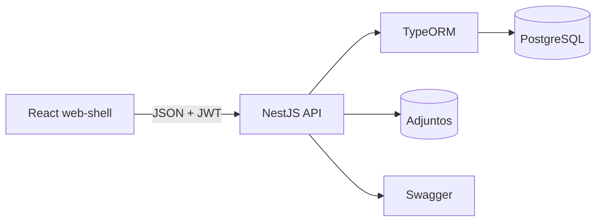
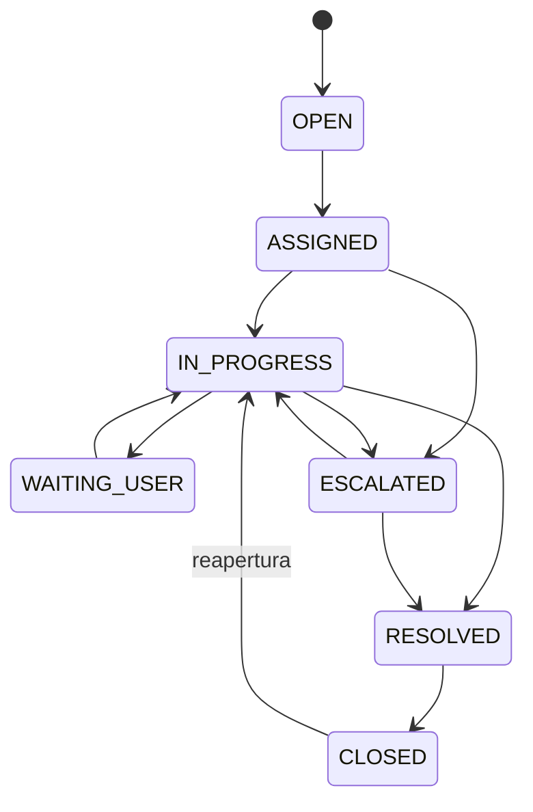

# Backend y base de datos de TicketFlow

## Arquitectura



La API usa módulos independientes para autenticación, usuarios, catálogos, tickets, analítica y base de conocimiento. Un interceptor normaliza todas las respuestas con el contrato `{ success, message, data, meta }` que consume el frontend.

## Modelo de datos

Las entidades persistidas son: `roles`, `permissions`, `role_permissions`, `users`, `refresh_tokens`, `categories`, `priorities`, `sla_policies`, `companies`, `ticket_counters`, `tickets`, `ticket_comments`, `ticket_attachments`, `ticket_history`, `satisfaction_surveys` y `knowledge_articles`.

La migración inicial se encuentra en `apps/backend/src/database/migrations`. Los folios se generan dentro de una transacción con bloqueo pesimista mediante `ticket_counters`, evitando folios duplicados bajo concurrencia.

## Rutas implementadas

| Módulo | Rutas principales |
|---|---|
| Autenticación | `POST /auth/login`, `POST /auth/refresh`, `POST /auth/logout`, `GET/PATCH /auth/me`, `POST /auth/change-password` |
| Usuarios | `GET/POST /users`, `GET/PUT /users/:id`, `PATCH /users/:id/status` |
| Catálogos | CRUD de categorías, prioridades y políticas SLA; consulta de empresas |
| Tickets | Crear, listar, filtrar, consultar, editar, asignar, cambiar estado, escalar y cerrar |
| Comunicación | Comentarios públicos/internos y adjuntos persistentes |
| SLA | `GET /tickets/:id/sla` y filtros `overdue`, `warning`, `on_time` |
| Encuesta | `POST /tickets/:id/survey` para el solicitante de un ticket cerrado |
| Dashboard | `GET /dashboard/summary` con métricas calculadas desde PostgreSQL |
| Reportes | Estado, agente, categoría/prioridad, empresa y cumplimiento SLA |
| Conocimiento | Consulta y mantenimiento de artículos frecuentes |

## Flujo de estados validado por el backend



Las transiciones no dibujadas se rechazan con HTTP 422. Además se valida el rol, si el usuario es solicitante o agente asignado y sus permisos efectivos.

## Respaldo y restauración de PostgreSQL

Con Docker Compose en ejecución:

```bash
docker compose exec -T postgres pg_dump -U ticketflow -d ticketflow -Fc > ticketflow.backup
cat ticketflow.backup | docker compose exec -T postgres pg_restore -U ticketflow -d ticketflow --clean --if-exists
```

Los archivos adjuntos están en el volumen `ticketflow_uploads`; deben respaldarse junto con la base de datos.
